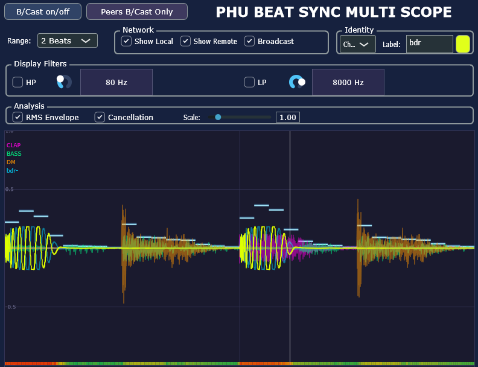
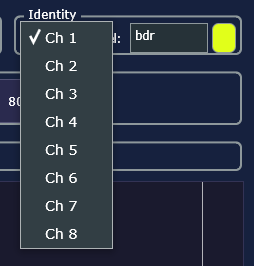
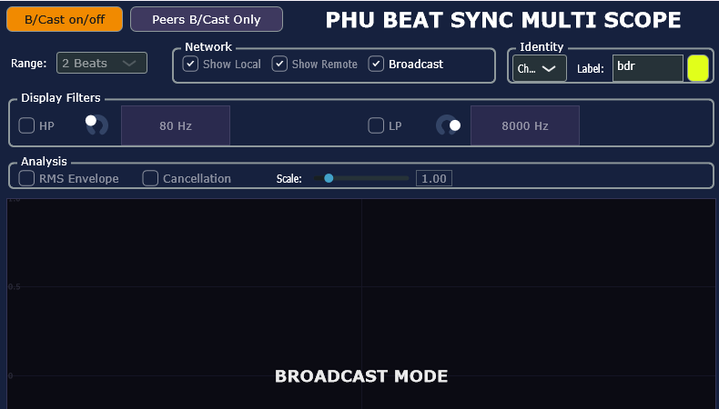

# PHU Beat Sync Multi Scope

[](https://github.com/huberp/phu-beat-sync-multi-scope/actions/workflows/build.yml)
[](https://github.com/huberp/phu-beat-sync-multi-scope/actions/workflows/release.yml)
[](LICENSE)
[](#building)
[](#building)
[](https://juce.com)
[](https://ko-fi.com/phuplugins)

A VST3 oscilloscope that loads on multiple DAW tracks simultaneously. All instances stay beat-aligned and share waveforms over the local network in real time — useful for comparing phase, level and transient alignment across tracks.



---

## Contents

- [Highlights](#highlights)
- [User Guide](#user-guide)
- [Cancellation Detector](#cancellation-detector)
- [License](#license)

---

## Highlights

🎯 **Beat-locked across every instance** — samples are stored at their absolute PPQ position, not in arrival order. Every instance, local or remote, always draws the same beat grid regardless of display range, network jitter, or when it joined the session.

📡 **Two-channel peer protocol — waveform data and live control** — a dedicated sample channel (UDP multicast, port 49422) streams beat-aligned float waveforms between instances while a separate control channel (port 49423) carries per-instance identity, heartbeats, colour assignments, and display-range metadata. Instances announce themselves automatically and are pruned after 3 seconds of silence; no server, no pairing, and no configuration required.

🔇 **Headless broadcast** — the sending side keeps running even when the plugin UI is closed. CPU overhead of a broadcasting instance with no open window is minimal.

⚡ **Broadcast-only mode** — instances that only need to feed data to others can suppress all display computation entirely, freeing CPU while staying visible to peers.

🎨 **Per-instance identity** — each instance carries a user-assigned channel index (Ch 1–8), a free-text label, and a colour. Remote instances are rendered in their own colour with their label, making multi-track comparison readable at a glance.

🎚️ **Display-path filtering** — 48 dB/oct Linkwitz-Riley HP and LP filters applied only to what you see, not to the audio. Isolate a frequency band without touching the mix.

🔬 **Phase cancellation detector** — a fine-grained colour bar (≤ 4 ms resolution) shows inter-instance cancellation continuously, level-weighted to suppress noise-floor artefacts. Not an approximation — it measures the actual RMS deviation from the incoherent sum.

---

## User Guide

### Installation

1. Download the latest release from [Releases](https://github.com/huberp/phu-beat-sync-multi-scope/releases)
2. Copy the plugin bundle to your DAW's plugin folder:
   - Windows: `C:\Program Files\Common Files\VST3\` (`.vst3`)
   - Linux: `~/.vst3/` or `/usr/lib/vst3/` (`.vst3`)
   - macOS AU: `~/Library/Audio/Plug-Ins/Components/` (`.component`)
   - macOS VST3: `~/Library/Audio/Plug-Ins/VST3/` (`.vst3`)
3. Rescan plugins in your DAW
4. Load **PHU BEAT SYNC MULTI SCOPE** on any tracks you want to compare

**Windows:** Requires the [Microsoft Visual C++ 2015–2022 Redistributable (x64)](https://aka.ms/vs/17/release/vc_redist.x64.exe). Already present if Visual Studio 2019 or 2022 is installed.  
**Linux:** No external dependencies — the binary is self-contained.  
**macOS Intel:** Download the `macos-intel-x86_64` release for Mac computers with an Intel processor.  
**macOS Apple Silicon:** Download the `macos-apple-silicon-arm64` release for Mac computers with an M-series chip.

### Setup

```
Track 1  →  [plugin]  Broadcast ✔  Show Remote ✔  Ch 1  "Kick"
Track 2  →  [plugin]  Broadcast ✔  Show Remote ✔  Ch 2  "Snare"
Track 3  →  [plugin]  Broadcast ✔  Show Remote ✔  Ch 3  "Bass"
```

Every instance that has **Broadcast** enabled sends its waveform via UDP multicast (`239.255.42.1:49423`) at ~30 Hz. All instances see each other automatically — no pairing required. Broadcasting continues even when the plugin window is closed.

### Controls

**Network group**

| Control | Function |
|---|---|
| Show Local | Hide/show the local waveform |
| Show Remote | Hide/show all received remote waveforms |
| Broadcast | Enable/disable sending this instance's waveform |
| B/Cast on/off | Broadcast-only mode — UI display disabled, CPU freed. If this instance is only meant for sending it's data to it' peers |
| Peers B/Cast Only | Sends a command to all peers to enter broadcast-only mode. If this instance is the single instance used for viewing |

**Identity group**

Each instance gets a channel number (Ch 1–8), a free-text label, and a colour. These are transmitted with every packet; all other instances use them to label and colour their overlaid waveforms.



**Range**

Selects the beat window shown — 1, 2, 4 or 8 beats. At high BPM, wider ranges are automatically greyed out when the buffer would be too large to be reliable.

**Display Filters**

HP and LP filters applied only to the display signal — the audio path is unaffected. Useful for isolating a frequency band without changing the mix.

**Analysis**

- 〰 **RMS Envelope** — step lines at every 1/16-note showing RMS level of the combined (local + all visible remote) signals
- 🟩 **Cancellation** — colour bar at the bottom of the scope indicating phase cancellation between instances: green = in-phase, yellow = partial, red = heavy cancellation



*In broadcast-only mode the scope display is replaced by a status overlay. All display computations stop, reducing CPU impact for instances that only need to feed data to others.*

---

## Cancellation Detector

The cancellation detector measures deviation of the combined signal from the incoherent sum of individual levels — a direct indicator of phase cancellation across tracks.

### Formula

For each time window of ~4 ms, the raw cancellation index is:

$$CI = 1 - \frac{\text{RMS}(L + R_1 + R_2 + \cdots)}{\text{RMS}(L) + \text{RMS}(R_1) + \text{RMS}(R_2) + \cdots}$$

The denominator is the maximum possible RMS if every instance were perfectly in-phase (triangle inequality). $CI \in [0, 1]$: 0 = no cancellation, 1 = total cancellation.

### Level Weighting

$CI$ values near the noise floor are suppressed to avoid false readings on near-silent signals:

$$CI_w = CI \cdot \sqrt{\min\!\left(1,\;\frac{D}{D_{\text{ref}}}\right)}$$

where $D = \text{RMS}(L) + \sum \text{RMS}(R_i)$ and $D_{\text{ref}} = 0.1$ (≈ −20 dBFS).

| $D$ | Weight | Effect |
|---|---|---|
| 0.01 (−40 dBFS) | 0.32 | Strongly suppressed |
| 0.03 (−30 dBFS) | 0.55 | Moderately suppressed |
| ≥ 0.10 (−20 dBFS) | 1.00 | Full CI displayed |

A hard gate (`sumIndividualRms > 0.01`) skips computation entirely below −40 dBFS.

### Colour Mapping

| $CI_w$ | Colour | Meaning |
|---|---|---|
| 0.0 | `#00BB55` green | In-phase |
| 0.4 | `#FFCC00` yellow | Partial cancellation |
| 1.0 | `#FF3300` red | Total cancellation |

### Resolution

256 windows span the full display range:

$$\Delta t \approx \frac{60}{\text{BPM}} \cdot \frac{R}{256} \text{ s}$$

At 120 BPM, 4-beat range: Δt ≈ 62 ms. At 1-beat range: Δt ≈ 15 ms.

---

## License

[MIT](LICENSE)
