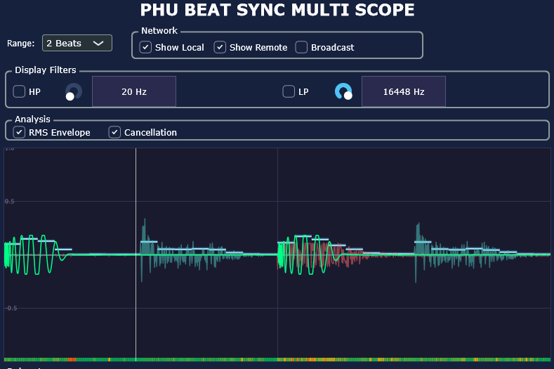

# PHU Beat Sync Multi Scope

[](https://github.com/huberp/phu-beat-sync-multi-scope/actions/workflows/build.yml)
[](https://github.com/huberp/phu-beat-sync-multi-scope/actions/workflows/release.yml)
[](LICENSE)
[](#building)
[](#building)
[](https://juce.com)

A JUCE-based VST3 audio plugin that provides a **beat-synced multi-instance oscilloscope**. Load it on multiple DAW tracks and all instances share their waveforms in real time over the local network — beats and bars stay pixel-perfect aligned regardless of display range or network jitter.

## Screenshot



*Two instances active: green = local track, red = remote track. RMS Envelope (blue glow) and Cancellation bar (bottom) overlays are enabled.*

## Features

### Waveform Display
- **Beat-synced oscilloscope**: audio samples are mapped to musical position (PPQ), so every instance shows the same beat grid regardless of playback position
- **Configurable display range**: 1/4, 1/2, 1, 2, 4, or 8 beats per window
- **Playhead marker**: live white vertical line tracking current PPQ position
- **Amplitude grid**: horizontal reference lines at 0, ±0.5, ±1.0 with labels

### Multi-Instance Networking
- **Show Local / Show Remote toggles**: independently show or hide the local and remote waveforms
- **Broadcast toggle**: enable/disable sending your waveform to other instances — broadcasting continues **headlessly** even when the plugin UI is closed
- **PPQ-accurate remote alignment**: each network packet carries a PPQ reference so remote waveforms are pinned correctly to the beat grid even when sender and receiver use different display ranges
- **Accumulation buffer**: remote bins are scatter-written into receiver-space, so a sender with a narrow range doesn't erase the rest of the display and a sender with a wide range doesn't double-paint

### Display Filters
- **High-pass and Low-pass filters** on the display path (does not affect the audio signal), with frequency knobs
- Filters update in real time as you move the knobs

### Analysis Overlays
- **RMS Envelope**: blue-glow step lines at every 1/16-note position showing the RMS amplitude of the summed signal (local + all visible remotes). Reflects only the local signal when *Show Remote* is off
- **Cancellation detector**: fine-grained colour bar at the bottom of the scope (~4 ms resolution) indicating inter-instance phase cancellation — green = in-phase, yellow = partial, red = high cancellation. Noise-floored at −40 dBFS to suppress false readings on silent signals

## Installation

1. Download the latest release from [Releases](https://github.com/huberp/phu-beat-sync-multi-scope/releases)
2. Copy the `.vst3` bundle to your DAW's VST3 plugin folder:
   - **Windows**: `C:\Program Files\Common Files\VST3\`
   - **Linux**: `~/.vst3/` or `/usr/lib/vst3/`
3. Rescan plugins in your DAW
4. Load **PHU BEAT SYNC MULTI SCOPE** on any number of tracks

> **No external dependencies** — the plugin binary is self-contained.

## Usage

1. Insert the plugin on two or more tracks (or send busses) you want to compare
2. Enable **Broadcast** on every instance you want to share — the signal is sent over UDP multicast on `239.255.42.1:49423` (local network only)
3. Enable **Show Remote** on the instances where you want to see the other tracks
4. Use the **Range** dropdown to zoom the beat window (all visible instances stay aligned)
5. Optionally enable **Display Filters** to focus on a frequency sub-band in the display
6. Enable **RMS Envelope** and/or **Cancellation** in the Analysis group to diagnose phase and level relationships

## Building

### Prerequisites

| Tool | Minimum version |
|---|---|
| CMake | 3.15 |
| C++ compiler | C++17 (MSVC 2022, GCC 11, Clang 14) |
| JUCE | 8.0.12 (included as submodule) |

### Clone

```bash
git clone https://github.com/huberp/phu-beat-sync-multi-scope.git
cd phu-beat-sync-multi-scope
git submodule update --init --recursive
```

### Windows

```bash
cmake -B build -DCMAKE_BUILD_TYPE=Release
cmake --build build --config Release
```

The `.vst3` bundle is output to `build/src/phu-beat-sync-multi-scope_artefacts/Release/VST3/`.

### Linux

```bash
sudo bash scripts/install-linux-deps.sh   # install JUCE system dependencies
cmake --preset linux-release
cmake --build --preset linux-build
```

If the build times out, reduce parallel jobs: `cmake --build --preset linux-build -j2`

## Architecture

### Core Components

| Component | Location | Responsibility |
|---|---|---|
| `BeatSyncBuffer` | `lib/audio/BeatSyncBuffer.h` | Position-indexed 4096-bin display buffer; maps audio samples to normalized beat position `[0,1)`. Audio-thread writes. |
| `AudioSampleFifo` | `lib/audio/AudioSampleFifo.h` | Lock-free FIFO transferring samples from audio thread to UI thread |
| `SyncGlobals` | `lib/events/SyncGlobals.h` | DAW sync state (BPM, PPQ, transport); atomic PPQ for UI reads |
| `MulticastBroadcasterBase` | `lib/network/MulticastBroadcasterBase.h` | Abstract UDP multicast infrastructure: socket management, receiver thread, platform abstraction |
| `SampleBroadcaster` | `lib/network/SampleBroadcaster.h` | Sends/receives beat-synced waveform packets; 8-bit quantized samples + PPQ reference |
| `ScopeDisplay` | `src/ScopeDisplay.h` | Oscilloscope component: beat-aligned rendering, accumulation buffers, RMS + cancellation overlays |
| `DisplayFilterStrip` | `src/DisplayFilterStrip.h` | HP/LP filter controls for the display path |
| `PluginProcessor` | `src/PluginProcessor.h` | Audio processing, `BeatSyncBuffer` writes, headless broadcast timer (~10 Hz) |

### Data Flow

```
Audio Thread (processBlock)
  ├─ Update DAW globals (BPM, PPQ, transport)
  ├─ Push samples to AudioSampleFifo (for display filters)
  └─ Write BeatSyncBuffer (PPQ → normalized position → bin)

Processor Timer (~10 Hz)  ← runs even when UI is closed
  └─ If Broadcast enabled: copy BeatSyncBuffer → SampleBroadcaster.send()

UI Timer (60 Hz)
  ├─ Read BeatSyncBuffer → apply DisplayFilters → ScopeDisplay.setLocalData()
  ├─ SampleBroadcaster.getReceivedSamples() → ScopeDisplay.setRemoteData()
  └─ Repaint: grid → RMS overlay → remote waveforms → local waveform → playhead
                                                     └─ cancellation bar (bottom)
```

### Remote Beat Alignment

Each packet carries `ppqPosition` and `displayRangeBeats`. The receiver projects sender bins into its own coordinate space:

```
senderWindowStart = floor(ppqPosition / senderRange) * senderRange
absolutePpq(i)    = senderWindowStart + (i / numBins) * senderRange
normPos           = fmod(absolutePpq, receiverRange) / receiverRange
receiverBin       = (int)(normPos * REMOTE_ACCUM_BINS)
```

Bins are scatter-written into a per-instance 1024-bin accumulation buffer (`m_remoteAccumBuffers`). Unbounded bins from previous packets persist across frames, preventing blinking when the sender has a narrower range than the receiver.

### Network Protocol

| Property | Value |
|---|---|
| Multicast group | `239.255.42.1` |
| Port | `49423` |
| Packet rate | ~30 Hz (33 ms throttle) |
| Sample encoding | 8-bit linear quantization (`0`=−1.0, `128`=0.0, `255`=+1.0) |
| Bins per packet | Up to 1024 |
| Staleness timeout | 3 s (pruned automatically) |

The multicast group is in the administratively-scoped range (RFC 2365) and will not route beyond the local LAN.

## Project Structure

```
phu-beat-sync-multi-scope/
├── CMakeLists.txt              # Root CMake config
├── CMakePresets.json           # Build presets (VS2026/x64, Linux Release)
├── doc/
│   └── screenshot.png          # UI screenshot
├── JUCE/                       # JUCE 8.0.12 (git submodule)
├── src/                        # Plugin implementation
│   ├── PluginProcessor.h/cpp   # Audio processing, beat-sync, headless broadcast timer
│   ├── PluginEditor.h/cpp      # UI layout, control wiring, 60 Hz UI timer
│   ├── ScopeDisplay.h/cpp      # Beat-synced oscilloscope + analysis overlays
│   ├── DisplayFilterStrip.h/cpp# HP/LP display filter controls
│   └── CMakeLists.txt
├── lib/                        # Reusable library components
│   ├── audio/
│   │   ├── AudioSampleFifo.h   # Lock-free sample FIFO (single-writer / single-reader)
│   │   └── BeatSyncBuffer.h    # Position-indexed display buffer (4096 bins)
│   ├── events/
│   │   ├── SyncGlobals.h       # BPM / PPQ / transport state (atomic PPQ)
│   │   └── SyncGlobalsListener.h
│   ├── network/
│   │   ├── MulticastBroadcasterBase.h/cpp  # UDP multicast socket + receiver thread
│   │   └── SampleBroadcaster.h/cpp         # Beat-synced waveform send/receive
│   ├── debug/
│   │   └── EditorLogger.h/cpp  # In-plugin debug log viewer
│   └── CMakeLists.txt
├── .github/
│   └── workflows/
│       ├── build.yml           # CI: Windows + Linux builds, pluginval VST3 validation
│       └── release.yml         # Release: cross-platform packaging
└── scripts/
    └── install-linux-deps.sh   # apt-get installer for JUCE Linux dependencies
```

## Contributing

Contributions are welcome! Please follow these steps:

1. Fork the repository and create your branch from `main`
2. Follow the existing code style (C++17, JUCE conventions)
3. Respect the hard rules in [`.github/copilot-instructions.md`](.github/copilot-instructions.md) — especially **never perform network I/O on the audio thread**
4. Ensure the project builds cleanly on Windows (CI will also test Linux)
5. Open a pull request with a clear description of the change

### Reporting Issues

Please open a [GitHub Issue](https://github.com/huberp/phu-beat-sync-multi-scope/issues) and include:
- DAW name and version
- OS and version
- Steps to reproduce
- Screenshot or screen recording if applicable

## Acknowledgements

- [JUCE](https://juce.com) — cross-platform audio application framework
- [pluginval](https://github.com/Tracktion/pluginval) — VST3 validation used in CI
- [phu-splitter](https://github.com/huberp/phu-splitter) — multicast networking pattern
- [phu-compressor](https://github.com/huberp/phu-compressor) — `BeatSyncBuffer` and `SyncGlobals`

## License

This project is licensed under the **MIT License** — see [LICENSE](LICENSE) for details.
