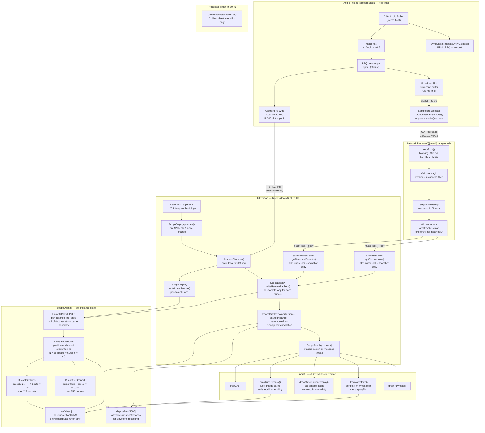

# Signal Path Analysis — phu-beat-sync-multi-scope

## Architecture Overview

Two completely separate data paths feed the oscilloscope display:
- **Local path**: raw audio from the DAW audio thread → SPSC ring → UI thread → RawSampleBuffer
- **Remote path**: UDP multicast loopback from audio thread → OS socket buffer → network receiver thread → mutex-protected map → UI thread → RawSampleBuffer

Both paths converge in `ScopeDisplay` on the UI thread, where all rendering work happens.

---

## Mermaid Diagram

---

## Textual Description

### Local Sample Path

1. **Audio Thread — `processBlock()`**
   Every block, `SyncGlobals::updateDAWGlobals()` extracts BPM, transport state, and the block-start PPQ from the DAW playhead. The stereo input is mono-mixed (`(L+R) × 0.5`). PPQ is linearly interpolated per-sample as `ppq_i = blockStartPpq + i × (bpm / (60 × sr))`.

2. **SPSC Ring Push** (`AbstractFifo`, capacity 12 700 slots)
   Each `(monoSample, absolutePpq)` pair is written into the lock-free ring using `AbstractFifo::write()`. The ring provides 4× headroom relative to the ~33 ms broadcast chunk. Overflow samples are silently dropped (ring sized generously enough that this should never happen at supported BPMs/SRs).

3. **UI Thread Drain** (60 Hz `timerCallback()`)
   `AbstractFifo::read()` drains all available samples in one batch. Each pair is forwarded to `ScopeDisplay::writeLocalSample()`.

4. **Filter + Write** (`ScopeDisplay::applyFilterAndWrite()`)
   The sample passes through the optional Linkwitz-Riley HP and/or LP filter (48 dB/oct). Filter state is reset whenever the PPQ crosses a new display-window boundary to eliminate transient artifacts. The filtered sample is written to `RawSampleBuffer` at the index `floor(fmod(ppq, displayBeats) / displayBeats × N)`.

5. **Dirty Marking**
   `RawSampleBuffer::write()` returns the affected index. Both `BucketSet::Rms` and `BucketSet::Cancel` mark the overlapping bucket dirty.

### Remote Sample Path

1. **Audio Thread — Ping-Pong Broadcast Buffer**
   In parallel with the local ring writes, each mono sample also accumulates into one of two `BroadcastSlot` structs (~33 ms capacity per slot). When the active slot fills up, `SampleBroadcaster::broadcastRawSamples()` is called directly from the audio thread using `sendto()` over the loopback interface. The call completes in <5 µs (loopback, no OS scheduling) and involves no locks.

2. **UDP Multicast** (group `239.255.42.1`, port `49422`)
   The packet carries: instance ID, monotonic sequence number, PPQ of the first sample, sender BPM, display range, and raw float samples.

3. **Network Receiver Thread** (background, per `MulticastBroadcasterBase`)
   `recvfrom()` blocks with a 100 ms timeout. Received packets are validated (magic, version, self-filter by instanceID). Sequence numbers are checked for wrap-safe deduplication. Only the *latest* packet per remote instanceID is kept in a `std::mutex`-protected `std::map`.

4. **UI Thread — `getReceivedPackets()`** (60 Hz)
   The UI timer acquires `receiveMutex`, copies the snapshot to `m_remoteDataCache` (vector reused across frames), prunes stale entries (>3 s), and releases the lock.

5. **`ScopeDisplay::writeRemotePackets()`**
   For each packet, per-sample PPQ is reconstructed using the *sender's* BPM and the *receiver's* sample rate (from a CtrlBroadcaster lookup). Each sample goes through the same `applyFilterAndWrite()` pipeline as local samples. Slot allocation is managed by a `std::map` keyed on instanceID.

6. **Frame Computation, Rendering** — identical to local path downstream.

### Frame Computation & Rendering

After both paths have written into their `RawSampleBuffer`s, `computeFrame()` is called:

- **`scatterInstance()`**: maps `RawSampleBuffer` samples to the 4096-bin `displayBins[]` array. Only bins belonging to dirty RMS buckets are rescattered (dirty-bucket iteration).
- **`recomputeRms()`**: iterates dirty `BucketSet::Rms` buckets, computes `sqrt(sumSq/count)`, and clears the dirty flag.
- **`recomputeCancellation()`**: iterates dirty `BucketSet::Cancel` buckets, computes the cancellation index across all active instances.

`paint()` is driven by `repaint()` on JUCE's message thread:
- **Grid** is drawn unconditionally.
- **RMS overlay** and **Cancellation overlay** are cached as off-screen `juce::Image` objects — they are only redrawn when `m_rmsOverlayDirty` / `m_cancelOverlayDirty` is set.
- **Waveforms** are rendered per pixel by downsampling `displayBins[]` to screen width with per-pixel min/max.
- **Playhead** is a single vertical line at the current PPQ position.

---

## Existing Optimizations

| Optimization | Where | Benefit |
|---|---|---|
| **Lock-free local ring** | `AbstractFifo` SPSC | Audio thread never blocks on UI reads |
| **Ping-pong broadcast slots** | `PluginProcessor::m_broadcastSlots` | Audio thread never waits; only one `sendto()` per ~33 ms slot, not per sample |
| **Dirty-bucket tracking** | `BucketSet::markDirty()` / `scatterInstance()` | Only changed regions of the display buffer are rescattered/recomputed |
| **Off-screen overlay caches** | `m_rmsOverlayImage`, `m_cancelOverlayImage` | RMS/cancellation images are only redrawn when data actually changed |
| **Cached APVTS raw pointers** | `m_pHpEnabled`, `m_pHpFreq`, etc. | Avoids string-keyed map lookup 60 times/sec |
| **`getReceivedPackets(out&)` reuse** | `m_remoteDataCache` | Reuses vector capacity — no heap allocation on hot path |
| **`getRemoteInfos(out&)` reuse** | `m_remoteInfosCache` | Same — no heap allocation on hot path |
| **Sequence deduplication** | `ScopeDisplay::writeRemotePackets()` | Skips redundant reprocessing if getReceivedPackets returns the same last packet twice |
| **Per-pixel min/max** | `drawWaveform()` | Single pass over bins, respects display resolution |
| **Scaled pixel pointers** | `processBlock()` | Raw buffer pointers hoisted out of per-sample loop, enables auto-vectorization of mono mix |
| **BPM-aware display range cap** | `getMaxDisplayBeatsForBpm()` | Keeps display window ≤ ~6 s, bounding `N` and bucket count |
| **RMS bucket position fix** | `drawRmsOverlay()` | Bucket x positions now derived from actual buffer index ranges rather than equal-width slots — eliminates fractional misalignment |

---

## Remaining Performance Problems

### 1. `writeRemotePackets()` — O(N²) slot search + O(N) packet loop on UI thread (≈33 ms work burst)

Each call iterates the full 6350-sample packet in a tight loop on the UI thread at 60 Hz *per remote instance*. At 192 kHz with 7 remotes that is up to ~44 000 `applyFilterAndWrite()` calls per frame — each involving two 48 dB cascaded filter evaluations. This is the primary cause of periodic UI jank.

**The deactivation scan** is O(instances × packets) on every frame, even when nothing changes.

### 2. `sendto()` on the audio thread

Although loopback `sendto()` is typically <5 µs, calling any syscall from the audio thread violates real-time safety in principle. On a loaded system or under a kernel patch (e.g. PREEMPT_RT), the call can block for an unbounded time and cause audio dropouts. The current design accepts this trade-off ("loopback-only"), but it is fragile.

### 3. `receiveMutex` contention — UI thread holds lock during full vector copy

`getReceivedPackets()` holds `receiveMutex` while copying potentially large `RemoteRawPacket` structs (each ~25 KB at max capacity). The receiver thread cannot store new packets during this window. At 60 Hz with multiple remotes this creates regular, predictable contention spikes.

### 4. `latestPackets` is a `std::map` with dynamic allocation per entry

The `std::map` in the receiver thread path requires heap allocation on every new instanceID and tree-rebalancing on every insert/erase. A fixed-capacity `std::array` of slots (max 7 remotes) would be allocation-free.

### 5. `computeFrame()` — full scatter on every dirty bucket even when not playing

When the DAW is stopped, the playhead is stationary but the ring buffer contents are still processed on every 60 Hz tick (because `m_rmsOverlayDirty` is always set when `writeLocalSample()` is called). Draining the ring and marking dirty continues even with no audio.

### 6. `paint()` called unconditionally at 60 Hz regardless of whether data changed

`scopeDisplay.repaint()` is called every frame in `timerCallback()` even when the audio is silent and nothing has changed. JUCE coalesces `repaint()` calls, but the `computeFrame()` + `recomputeRms()` work happens before the repaint, unconditionally.

### 7. `drawWaveform()` uses `juce::Path` filled on every frame

A new `juce::Path` is constructed and stroked on every `paint()` for every active instance. `juce::Path` involves dynamic heap allocation. With 8 instances at 60 Hz this creates continuous GC pressure on the UI thread.

### 8. `recomputeCancellation()` iterates all N buffer samples per dirty bucket

For each dirty cancel bucket, the cancellation computation sums all *buffer* samples (via `inst.buffer.data()[i]`) across all instances. For a 4-beat display at 192 kHz / 40 BPM, `N ≈ 1 152 000` — this loop becomes extremely expensive with multiple active instances.

### 9. Remote `prepareInstance()` called on slot allocation (inside UI timer / write loop)

When a new remote instance is seen for the first time, `prepareInstance()` is called from inside `writeRemotePackets()` which is called from `timerCallback()`. `prepareInstance()` allocates several `std::vector`s and resets filter state — a heap allocation on the 60 Hz hot path.

### 10. `clearRemoteInstances()` called every frame when remote display is toggled off

When "Show Remote" is off, `scopeDisplay.clearRemoteInstances()` is called unconditionally on every 60 Hz tick. It assigns zeros to all `displayBins[]` vectors (7 × 4096 floats = ~114 KB zeroed every frame for nothing).
